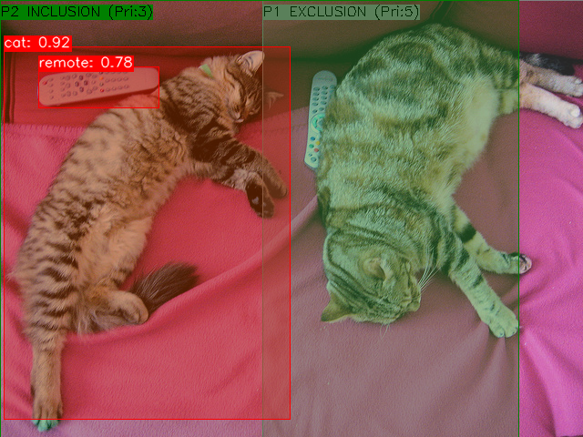

# aa-video



A small C++ project for object detection using YOLO models and OpenCV.
It uses gRPC for client-server communication.

Full docs: [Complete docs](https://stolyarchuk.github.io/aa-video/)

## What it does

- Runs YOLO models (.onnx) with OpenCV DNN.
- Serves detection results over gRPC.
- Supports polygon-based include/exclude zones with priorities.
- Provides tests and basic CI integration.

## Quick start

You need CMake, a C++23 compiler, OpenCV, gRPC, and protobuf.

Configure and build (debug):

```bash
cmake -B build -S . -DCMAKE_BUILD_TYPE=Debug
cmake --build build
```

Run the server with a model:

```bash
./build/server/detector_server --model=./models/yolox_s.onnx --verbose=true
```

Run the client on an image:

```bash
./build/client/detector_client --input=input/000000039769.jpg --verbose=true
```

Run tests:

```bash
cmake --build build --target test
ctest --test-dir build --output-on-failure
```

## Project layout

- `client/` - client app
- `server/` - server app and inference code
- `shared/` - proto and shared code
- `models/` - sample models
- `tests/` - unit tests

## Notes

- The code targets C++23 and follows Google style rules.
- Polygon filtering, NMS, and coordinate scaling are implemented.
- See the docs link above for detailed guides and API reference.

## Contributing

Pull requests are welcome. Follow the repo's contribution guide.

## License

MIT. See the `LICENSE` file.
